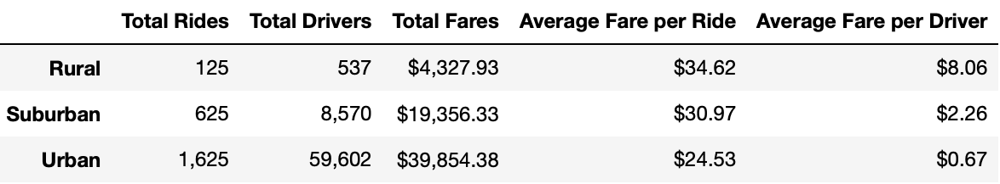
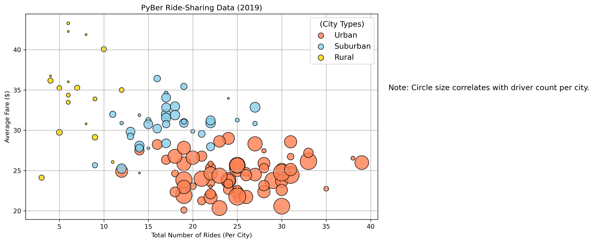
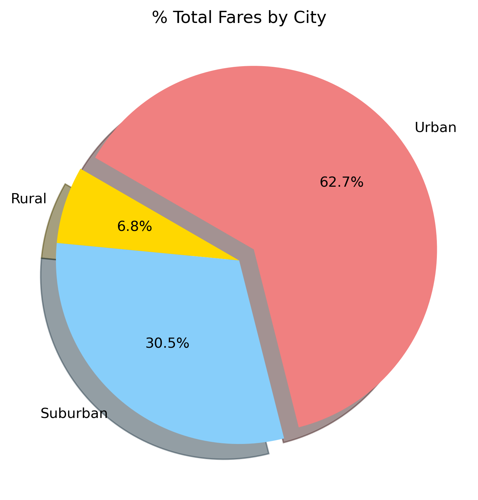
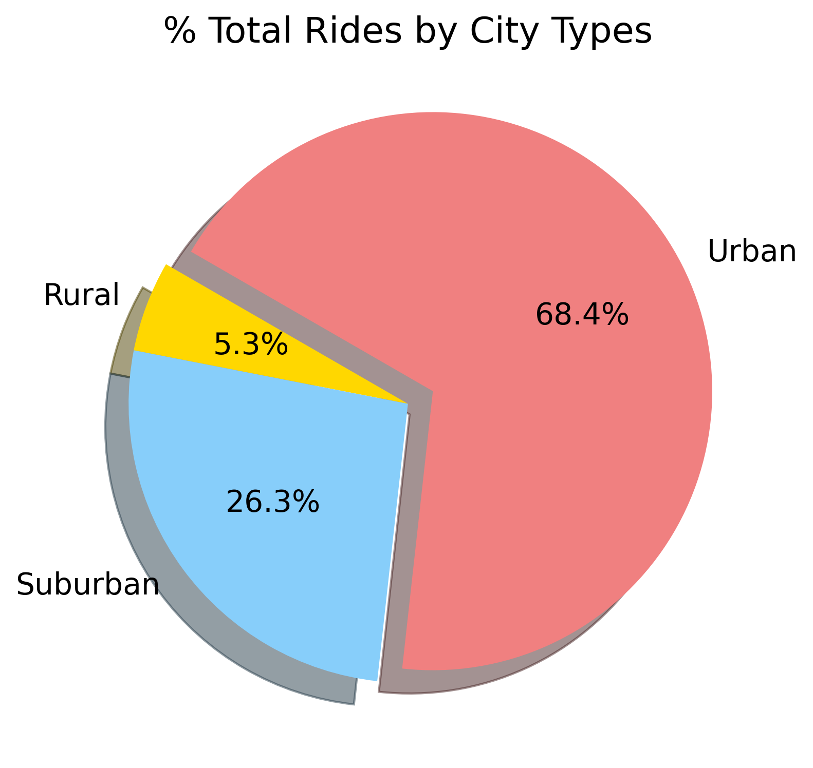

# PyBer_Analysis
## Overview ##
This analysis serves to explain and visualize the Pyber Ride Sharing company's overall operations and revenues. The analysis filters the company's data by 3 levels of city type: urban, suburban and rural; and, considers such parameters as number of drivers/rides per city and type, overall fares, and fares per ride or per driver.    
## Results ## 

Below is an overview summary of Pyber's business operations.  
    
This chart clearly shows that as the city increases in distinction from Rural towards Urban the Total Rides, Drivers and Fares increases significantly, while the average Fares per Ride and per Driver become significantly less. Considering population density and ease of access, this makes sense as there are more people who would need rides in a more densely populated place, and the more rural the more spacious a city's layout thus increasing the length of any rides and driving up (pardon the pun) the price of the average fare.  
While the average fare per ride in Urban cities is much less than in Rural or Suburban, it is clear that Urban cities provide greater revenue than Rural and Suburban cities combined. The figure below clarifies these assertions by demonstrating the quality of the rides analyzed per type of city.
 
For clarity sake, the upper right-most yellow dot indicates a Rural city (yellow) with a small number of drivers (circle size), that had a high Average Fare but relatively few rides.     
Additionally, the pie charts below clarify the breakdown of Fares, Rides and Drivers by city types.  

  
   
  

 
The Total Fare by City Type graph below depicts a breakdown of revenue earned per week by the different city types. 

Overall, Fares in each city type dipped at the beginning of January and experienced high points in late February. Both Urban and Suburban city revenues remained higher than the initial dip at the beginning of January throughout the 4 month period of time. Rural fares remained the steadiest, and lowest, during this time. By comparison, Suburban Fares seemed to ebb and flow over a 2 month period and Urban data seemed the most erratic while also staying the most above its initial January starting amount.  
Overall, despite a bump in traffic near Valentine's Day, Fares remained steady during this period of time.  

## Summary ##
Given the analysis